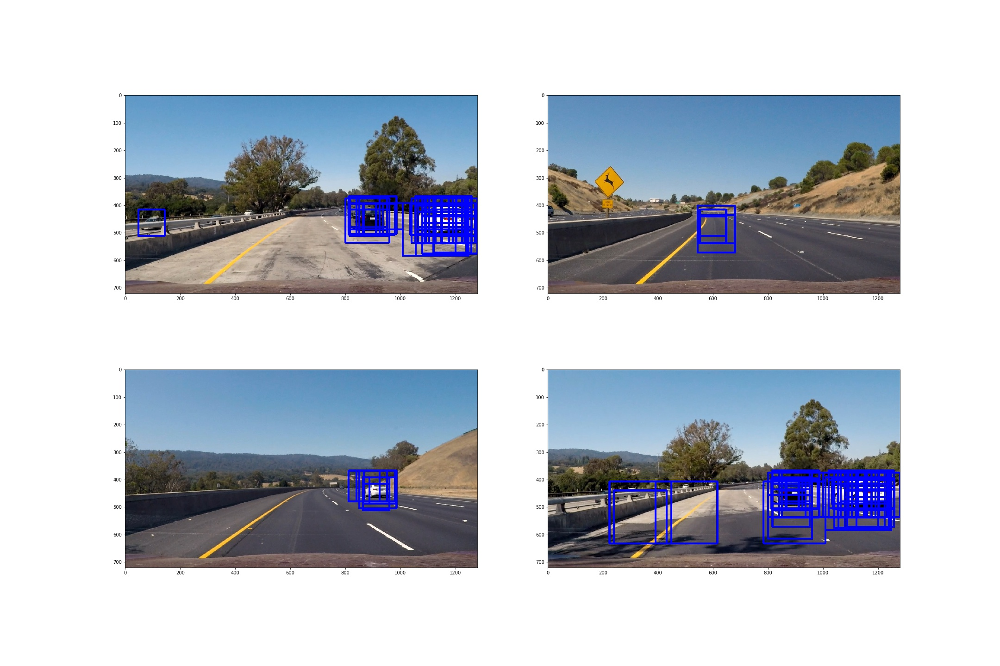

**Vehicle Detection Project**

The goals / steps of this project are the following:

* Perform a Histogram of Oriented Gradients (HOG) feature extraction on a labeled training set of images and train a classifier Linear SVM classifier
* Optionally, you can also apply a color transform and append binned color features, as well as histograms of color, to your HOG feature vector.
* Note: for those first two steps don't forget to normalize your features and randomize a selection for training and testing.
* Implement a sliding-window technique and use your trained classifier to search for vehicles in images.
* Run your pipeline on a video stream (start with the test_video.mp4 and later implement on full project_video.mp4) and create a heat map of recurring detections frame by frame to reject outliers and follow detected vehicles.
* Estimate a bounding box for vehicles detected.

[//]: # (Image References)
[image1]: ./examples/car_not_car.png
[image2]: ./examples/HOG_example.jpg
[image3]: ./examples/sliding_windows.jpg
[image4]: ./examples/sliding_window.jpg
[image5]: ./examples/bboxes_and_heat.png
[image6]: ./examples/labels_map.png
[image7]: ./examples/output_bboxes.png
[video1]: ./project_video.mp4

## [Rubric](https://review.udacity.com/#!/rubrics/513/view) Points
###Here I will consider the rubric points individually and describe how I addressed each point in my implementation.  

---
###Writeup / README

####1. Provide a Writeup / README that includes all the rubric points and how you addressed each one.  You can submit your writeup as markdown or pdf.  [Here](https://github.com/udacity/CarND-Vehicle-Detection/blob/master/writeup_template.md) is a template writeup for this project you can use as a guide and a starting point.  

You're reading it!

###Histogram of Oriented Gradients (HOG)

####1. Explain how (and identify where in your code) you extracted HOG features from the training images.

The code for extracting features (hog features included) for training data is
in cell 8 of the Jupyter notebook vehicle-tracking-train-model.ipynb
the code there calls a function named extract_feature_from_array which is defined in line 130 through 192 in functions.py, extract_feature_from_array then called another function get_hog_features which is defined in line 67 through 95 in functions.py.

I use the "YUV" color space and extract hog features from all 3 channels.

####2. Explain how you settled on your final choice of HOG parameters.

The hog features part of course asked me to experiment with different parameters to how it works, and I find that the *"YUV"* channels works the best so I used channel "YNV" in my solution. I also get the feel that use *"ALL"* channel works better than a single channel in when was playing with the course content on hog features. It seems that 8 is a quite reasonable value for pix_per_cell considering the image size in the training data, but I changed it to *16* in order to reduce feature vector dimension and speedup training. As for cell_per_block, when I was playing with different parameters in the course, 4 works better than 2, but later I changed it to *2* when training my model to speedup the training process.

####3. Describe how (and identify where in your code) you trained a classifier using your selected HOG features (and color features if you used them).

I trained a linear SVM using both color histogram and hog features. I used validation set accuracy to choose the best parameter for C among candidates, the final chosen value is 1. I also normalized features using StandardScaler from sklearn. The code is in cell 9  and cell 12.

###Sliding Window Search

####1. Describe how (and identify where in your code) you implemented a sliding window search.  How did you decide what scales to search and how much to overlap windows?

First, I compute the window list giving the image size and the window size
, window search area and window overlapping parameters. Next, I compute
hog features for the bottom half of the image. Then I iterate through the
all the windows, extract color histogram features, slicing the hog
features array to get hog features for each window and concatenate color
histogram and hog features together, appending the concatenated feature
vector to a list containing features for all windows. Then I convert
the list of feature vectors to an matrix, normalize feature and predict.
Finally I find out positive predictions and update heat map, finding
cars in heat map and draw boxes around found cars (code 554 through
  677 in functions.py).

I used window size 96, 112, 136, 160, 192 and 224, I think these scales
should be able to cover cars from small (far) to large (near). As to
overlap, I used 0.75, it's kind of gut feeling.

####2. Show some examples of test images to demonstrate how your pipeline is working.  What did you do to optimize the performance of your classifier?

Ultimately I searched on six scales using YUV 3-channel HOG features plus histograms of color in the feature vector, which provided a nice result.  Here are some example images:

---

### Video Implementation

####1. Provide a link to your final video output.  Your pipeline should perform reasonably well on the entire project video (somewhat wobbly or unstable bounding boxes are ok as long as you are identifying the vehicles most of the time with minimal false positives.)
Here's a [link to my video result](./project_video_out.mp4)

####2. Describe how (and identify where in your code) you implemented some kind of filter for false positives and some method for combining overlapping bounding boxes.

I recorded the positions of positive detections in each frame of the video.  From the positive detections I created a heatmap and then thresholded that map to identify vehicle positions.  I then used `scipy.ndimage.measurements.label()` to identify individual blobs in the heatmap.  I then assumed each blob corresponded to a vehicle.  I constructed bounding boxes to cover the area of each blob detected.  

Here's an example result showing the heatmap from a series of frames of video, the result of `scipy.ndimage.measurements.label()` and the bounding boxes then overlaid on the last frame of video:

### Here are six frames and their corresponding heatmaps:

### Here is the output of `scipy.ndimage.measurements.label()` on the integrated heatmap from all six frames:
![label map]["./output_images/label.jpg"]

### Here the resulting bounding boxes are drawn onto the last frame in the series:

---

###Discussion

####1. Briefly discuss any problems / issues you faced in your implementation of this project.  Where will your pipeline likely fail?  What could you do to make it more robust?

Here I'll talk about the approach I took, what techniques I used, what worked and why, where the pipeline might fail and how I might improve it if I were going to pursue this project further.  

1. In my initial tryings, my pipeline gives me a lot of false positives, so
I augmented the training data to get much more training data (ten times more),
with more training data, the result is stable finally.

2. Even though I did try to change the brightness of images when augmenting data, but I think the pipeline may fail under extreme lighting conditions. Some
technique like signal filters may help.

3. My implementation now is quite slow, I don't think it could be used in
a real self driving car, because I think the computation resources will be limited. I am thinking an algorithm that search recursively in smaller and smaller regions, and if it's certain there is no car in a region, then it stops
search subregions of this region may help to achieve better performance.

4. A neural network classifier will definitely do better.
